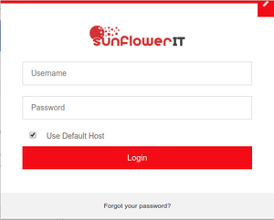

Therp Timer Chrome app is used to log hours and automatically write them to Odoo Timesheets.

It connects to Therp odoo and displays task list. From the list, one can start timer based on the issue,
set start and end time of the issue and when stop button is clicked, a new timesheet line record is added to Odoo.

Features:

* Start issue timer.
* Edit issue time.
* Stop issue timer.
* Create odoo timesheet line record linked to analytic account.
* Change issue state - eg. start or finish issue.
* Support tasks instead of issues
* Show own issues or all issues

Installation
------------

1. `git clone git@github.com:sunflowerit/sfit-timer.git`
2. Browse to [chrome://extensions/](chrome://extensions/)
3. Select 'load unpacked' and point to the 'src' folder
4. The app will now appear in the top-right of your Chrome browser

Configuration
-------------

* When you clicking on the Therp Timer button in Chrome for the first time, the log in screen comes up.
* Uncheck the 'Use Default Host' box at the buttom, and use the correct URL and database name.
* For Username and Password, use your regular Therp Odoo login info.

Usage
-----

* After logging in, a list of your active issues will show up.
* Use the green buttons to start and stop working on an issue. It will automatically show up on your Timesheet
* Time worked is rounded up or down to the nearest 15 minutes, this so we can keep our invoicing nice and clean.
* Tick 'all' to have other people's issue show up in this list as well; useful for multidev tasks!
* Under 'options' there's a switch to write time on ''tasks'' instead of ''issues'', we'll be using this in the future :)

Update
------

1. `cd /path/to/sfit-timer`
2. `git pull`
3. update on chrome://extensions

