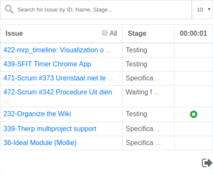

SFIT Timer Chrome app is used to log hours and automatically write them to Odoo Timesheets.

Installation
------------

1. Git clone git@github.com:sunflowerit/sfit-timer.git
2. Browse to chrome://extensions/ 
3. Select 'load unpacked' and point to the 'src' folder
4. The app will now appear in the top-right of your Chrome browser

Configuration
-------------

* When you clicking on the SFIT Timer button in Chrome for the first time, the log in screen comes up.
* Uncheck the 'Use Default Host' box at the buttom, and use the info below.
* For Username and Password, use your regular SFIT Odoo login info.

Usage
-----

* After logging in, a list of your active issues will show up.
* Use the green buttons to start and stop working on an issue. It will automatically show up on your Timesheet
* Time worked is rounded up or down to the nearest 15 minutes, this so we can keep our invoicing nice and clean.
* Tick 'all' to have other people's issue show up in this list as well; useful for multidev tasks!
* Under 'options' there's a switch to write time on ''tasks'' instead of ''issues'', we'll be using this in the future :)

Update
------

1. cd /path/to/sfit-timer
2. git pull

